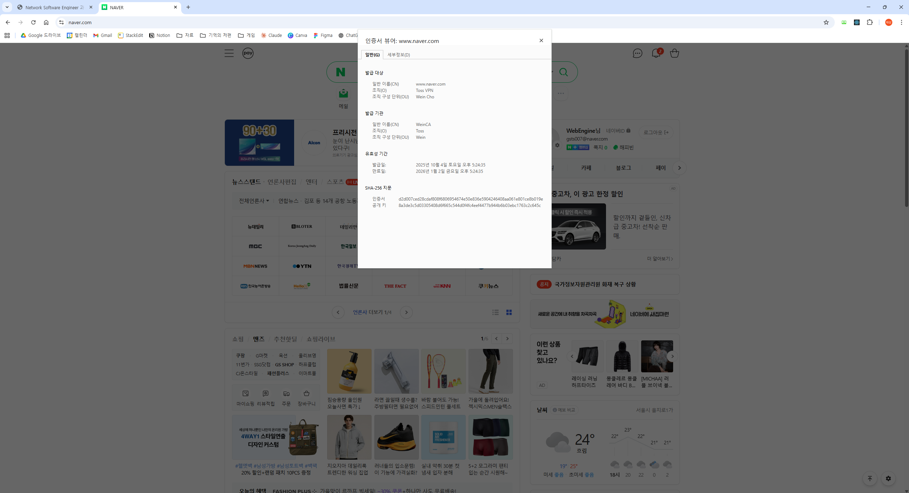

# Network Software Engineer 과제
- Author : 조태상(gsts007@gmail.com)

## 프로젝트 빌드 및 실행 방법

### 프로젝트 기반 환경
```
AWS EC2 Ubuntu 24.04 x86_64 6.14.0-1011-aws
```

### 프로젝트 의존성 설치
```shell
# install go
wget https://go.dev/dl/go1.25.1.linux-amd64.tar.gz
sudo rm -rf /usr/local/go && sudo tar -C /usr/local -xzf go1.25.1.linux-amd64.tar.gz
echo 'export PATH=$PATH:/usr/local/go/bin' > ~/.bashrc
source ~/.bashrc

# install deps
sudo apt update
sudo apt install -y \
  wireguard \
  resolvconf \
  libnetfilter-queue-dev \
  libnfnetlink-dev \
  build-essential \
  pkg-config \
  libmnl-dev
```

### 빌드
```shell
go build -o ./build/toss
```

### 실행
```shell
# wireguard 실행
sudo wg-quick up ./wireguard/wg0.conf

# tproxy application 실행
sudo ./build/toss
```

## 주요 기능 및 구현 방식

### 1. VPN 트래픽 수신
WireGuard VPN에서 전송되는 트래픽을 수신합니다.

WireGuard로 wg0 인터페이스를 생성하고, wg0 인터페이스로 들어오는 패킷들을 TPROXY를 사용하여 가로채 처리합니다.
TPROXY application에서 원래 목적지와 연결하여 패킷을 처리합니다.

또한, 사설 IP 대역(10.0.0.0/24)에서 목적지로 나가는 패킷을 MASQUERADE하여 공인 IP로 변환하여 통신하도록 합니다. 

### 2. 트래픽 필터링
TCP 포트와 관계 없이 HTTP/1.1, HTTP/2(h2) 프로토콜을 식별하여 패킷을 처리합니다.  
이 외의 프로토콜은 그대로 송수신하여 정상 동작합니다.

 - HTTP/1.1 프로토콜은 처음 전송되는 HTTP Method(`GET`, `POST`, `DELETE` 등)를 인식합니다. (http11_detector.go)   
 - HTTP/2(h2) 프로토콜은 처음 전송되는 `PRI * HTTP/2.0` 를 인식합니다. (`http2_detector.go`)  
 - TLS 프로토콜은 처음 전송되는 `ClientHello` 메세지를 인식합니다. (`tls_detector.go`)
 - TCP 스트림 데이터가 일정량(128 B) 이상이 되었음에도 감지에 실패하는 경우 모르는 프로토콜로 간주하고 그대로 송수신합니다. (`detect_handler.go`)
 - Server-side부터 TCP 메세지가 시작되는 케이스(ex. MySQL)에 대한 처리도 구현했습니다.

### 3. HTTP/HTTPS MITM 프록시
HTTP/HTTPS 트래픽에서 대해서 self-signed CA 인증서를 기반으로 TLS 변조를 수행합니다.

#### TLS (`tls_handler.go`)
- 클라이언트가 요청한 ClientHello 정보를 기반으로, 목적 서버에 TLS handshake를 수행합니다.
- 목적 서버의 TLS handshake가 성공하면, 클라이언트가 요청한 ServerName으로 self-signed CA 기반 TLS 인증서를 생성하고 handshake 합니다.
- 이 때, 클라이언트, 서버의 SNI, ALPN 정보를 유지하고, ALPN에 따라 HTTP/1.1, HTTP/2(h2)로 분기하여 처리하였습니다.
- TLS handshake에는 `crypto` 라이브러리를 활용하였습니다.

#### HTTP/1.1 (`http11_handler.go`)
- HTTP/1.1 프로토콜은 단일 요청/단일 응답이 반복되는 단순한 구조로 `net/http` 라이브러리를 통해 HTTP request, response를 파싱했습니다.
- HTTP/1.1에서 WebSocket으로 업그레이드 되는 경우, 단일 요청/단일 응답 구조가 깨지므로 별도로 처리합니다.

#### HTTP/2 (`http2_handler.go`)
- h2 프로토콜은 http2 frame을 통해 다양한 요청/응답이 양방향으로 오갈 수 있기 때문에, HTTP/1.1 처럼 단순한 구현이 어렵습니다.
- `golang.org/x/net/http2` 라이브러리를 활용하여, Downstream TCP Connection을 처리하는 HTTP2 서버를 생성하고 들어오는 요청들을 Upstream TCP Connection에 h2 프로토콜로 전송하였습니다.

### 4. 로깅
Application에서 발생하는 다양한 로그를 기록합니다.
또한, HTTP/HTTPS 트래픽의 request, response 내용을 상세히 기록합니다.

- `slog`를 활용하여 구조화 된 로그 시스템을 설정하였습니다.
- 동일한 tcp stream을 추적할 수 있도록 tunnel id, src addr, dst addr를 기록했습니다.

- http1.1, h2의 요청 method, host, url, body / 응답 status, status code, headers, body를 기록하였습니다.
- 이 때, 요청 및 응답 body는 양이 많을 수 있으므로 128B로 자르고 string으로 변환했습니다.

### 5. 특정 호스트 HTTPS MITM 공격 제외
`https://www.example.com`, `https://1.1.1.1`에 대한 MITM 공격을 제외합니다.

- TLS 감지 구현체(`tls_detector.go`)에서 Client Hello 메세지의 ServerName Extension을 추출합니다.
- ServerName extension의 내용이 허용된 domain 목록에 매칭되는 경우, TLS 처리 구현체(`tls_handler.go`)가 아닌 ByPass 구현체 (`bypass_handler.go`)로 처리합니다.
- `1.1.1.1`과 같은 IP Address의 경우 domain이 아니기 때문에 목적지 IP 주소를 매칭해서 처리했습니다.

### 6. 프로토콜 HTTP/3 기반 MITM 프록시
구현하지 못했습니다.

## 각 기능별 테스트 방법 및 결과

### 0. 사전 준비
 - Server
   - VPN 서버 구축
   - `프로젝트 빌드 및 실행 방법` 항목 참고
 - Client
   - self-signed CA 인증서 설치 `./tls/rootCA.pem`
   - WireGuard 설치
   - WireGuard 클라이언트 활성화
     - WireGuard 클라이언트 설정파일: `./wireguard/client.conf`
     - `Endpoint`는 구축한 서버의 Public IP로 설정
     - `AllowedIPs`는 VPN으로 패킷을 보낼 IPv4 CIDR 설정 (ex. `0.0.0.0/0`)
       - `0.0.0.0/0` 을 사용할 경우 VPN 서버에 SSH 접속이 원할하지 못할 수 있음
       - `0.0.0.0/0` 에서 특정 IP를 뺀 CIDR를 자동으로 계산해주는 사이트: https://www.procustodibus.com/blog/2021/03/wireguard-allowedips-calculator/
 
### 1. HTTP/1.1, HTTP/2 및 TLS 변조
#### 테스트 방법
아래 스크립트 실행
```shell
# HTTP/1.1
curl http://www.naver.com -s -v -o /dev/null

# HTTPS/1.1
curl https://www.naver.com -s -v --http1.1 -o /dev/null

# HTTPS/2
curl https://www.naver.com -s -v --http2 -o /dev/null
```

#### HTTP 1.1 테스트 결과
```shell
$ curl http://www.naver.com -s -v -o /dev/null
*   Trying 223.130.200.219:80...
* Connected to www.naver.com (223.130.200.219) port 80 (#0)
> GET / HTTP/1.1
> Host: www.naver.com
> User-Agent: curl/7.80.0
> Accept: */*
>
* Mark bundle as not supporting multiuse
< HTTP/1.1 302 Moved Temporarily
< Transfer-Encoding: chunked
< Content-Type: text/html
< Date: Sat, 04 Oct 2025 07:50:38 GMT
< Location: https://www.naver.com/
< Referrer-Policy: unsafe-url
< Server: nfront
< Vary: Accept-Encoding,User-Agent
<
{ [149 bytes data]
* Connection #0 to host www.naver.com left intact
```

#### HTTPS/1.1 테스트 결과
```shell
$ curl https://www.naver.com -s -v --http1.1 -o /dev/null
*   Trying 223.130.200.219:443...
* Connected to www.naver.com (223.130.200.219) port 443 (#0)
* ALPN, offering http/1.1
*  CAfile: C:/Program Files/Git/mingw64/ssl/certs/ca-bundle.crt
*  CApath: none
} [5 bytes data]
* TLSv1.3 (OUT), TLS handshake, Client hello (1):
} [512 bytes data]
* TLSv1.3 (IN), TLS handshake, Server hello (2):
{ [122 bytes data]
* TLSv1.3 (IN), TLS handshake, Encrypted Extensions (8):
{ [25 bytes data]
* TLSv1.3 (IN), TLS handshake, Certificate (11):
{ [1207 bytes data]
* TLSv1.3 (IN), TLS handshake, CERT verify (15):
{ [264 bytes data]
* TLSv1.3 (IN), TLS handshake, Finished (20):
{ [36 bytes data]
* TLSv1.3 (OUT), TLS change cipher, Change cipher spec (1):
} [1 bytes data]
* TLSv1.3 (OUT), TLS handshake, Finished (20):
} [36 bytes data]
* SSL connection using TLSv1.3 / TLS_AES_128_GCM_SHA256
* ALPN, server accepted to use http/1.1
* Server certificate:
*  subject: O=Toss VPN; OU=Wein Cho; CN=www.naver.com
*  start date: Oct  4 07:46:00 2025 GMT
*  expire date: Jan  2 07:46:00 2026 GMT
*  subjectAltName: host "www.naver.com" matched cert's "www.naver.com"
*  issuer: C=KR; ST=Seoul; O=Toss; OU=Wein; CN=WeinCA; emailAddress=gsts007@gmail.com
*  SSL certificate verify ok.
} [5 bytes data]
> GET / HTTP/1.1
> Host: www.naver.com
> User-Agent: curl/7.80.0
> Accept: */*
>
{ [5 bytes data]
* TLSv1.3 (IN), TLS handshake, Newsession Ticket (4):
{ [122 bytes data]
* Mark bundle as not supporting multiuse
< HTTP/1.1 200 OK
< Transfer-Encoding: chunked
< Cache-Control: no-cache, no-store, must-revalidate
< Content-Type: text/html; charset=UTF-8
< Date: Sat, 04 Oct 2025 07:51:00 GMT
< Pragma: no-cache
< Referrer-Policy: unsafe-url
< Server: nfront
< Strict-Transport-Security: max-age=63072000; includeSubdomains
< X-Frame-Options: DENY
< X-Xss-Protection: 1; mode=block
<
{ [827 bytes data]
* Connection #0 to host www.naver.com left intact
```
- `issuer: C=KR; ST=Seoul; O=Toss; OU=Wein; CN=WeinCA; emailAddress=gsts007@gmail.com`를 보면 TLS가 정상 변조된 것을 확인 할 수 있습니다.

#### HTTPS/2 테스트 결과
```
$ curl https://www.naver.com -s -v --http2 -o /dev/null
*   Trying 223.130.200.219:443...
* Connected to www.naver.com (223.130.200.219) port 443 (#0)
* ALPN, offering h2
* ALPN, offering http/1.1
*  CAfile: C:/Program Files/Git/mingw64/ssl/certs/ca-bundle.crt
*  CApath: none
} [5 bytes data]
* TLSv1.3 (OUT), TLS handshake, Client hello (1):
} [512 bytes data]
* TLSv1.3 (IN), TLS handshake, Server hello (2):
{ [122 bytes data]
* TLSv1.3 (IN), TLS handshake, Encrypted Extensions (8):
{ [19 bytes data]
* TLSv1.3 (IN), TLS handshake, Certificate (11):
{ [1208 bytes data]
* TLSv1.3 (IN), TLS handshake, CERT verify (15):
{ [264 bytes data]
* TLSv1.3 (IN), TLS handshake, Finished (20):
{ [36 bytes data]
* TLSv1.3 (OUT), TLS change cipher, Change cipher spec (1):
} [1 bytes data]
* TLSv1.3 (OUT), TLS handshake, Finished (20):
} [36 bytes data]
* SSL connection using TLSv1.3 / TLS_AES_128_GCM_SHA256
* ALPN, server accepted to use h2
* Server certificate:
*  subject: O=Toss VPN; OU=Wein Cho; CN=www.naver.com
*  start date: Oct  4 07:46:40 2025 GMT
*  expire date: Jan  2 07:46:40 2026 GMT
*  subjectAltName: host "www.naver.com" matched cert's "www.naver.com"
*  issuer: C=KR; ST=Seoul; O=Toss; OU=Wein; CN=WeinCA; emailAddress=gsts007@gmail.com
*  SSL certificate verify ok.
* Using HTTP2, server supports multiplexing
* Connection state changed (HTTP/2 confirmed)
* Copying HTTP/2 data in stream buffer to connection buffer after upgrade: len=0
} [5 bytes data]
* Using Stream ID: 1 (easy handle 0x1b6f9942080)
} [5 bytes data]
> GET / HTTP/2
> Host: www.naver.com
> user-agent: curl/7.80.0
> accept: */*
>
{ [5 bytes data]
* TLSv1.3 (IN), TLS handshake, Newsession Ticket (4):
{ [122 bytes data]
* Connection state changed (MAX_CONCURRENT_STREAMS == 250)!
} [5 bytes data]
< HTTP/2 200 
< cache-control: no-cache, no-store, must-revalidate
< content-type: text/html; charset=UTF-8
< date: Sat, 04 Oct 2025 07:51:40 GMT
< pragma: no-cache
< referrer-policy: unsafe-url
< server: nfront
< strict-transport-security: max-age=63072000; includeSubdomains
< x-frame-options: DENY
< x-xss-protection: 1; mode=block
<
{ [5 bytes data]
* Connection #0 to host www.naver.com left intact
```
- `issuer: C=KR; ST=Seoul; O=Toss; OU=Wein; CN=WeinCA; emailAddress=gsts007@gmail.com`를 보면 TLS가 정상 변조된 것을 확인 할 수 있습니다.

### 2. HTTPS MITM 예외 도메인 및 IP

#### 테스트 방법
```shell
curl https://www.example.com -s -v -o /dev/null
curl https://1.1.1.1 -s -v -o /dev/null
```

#### https://www.example.com 테스트 결과
```shell
$ curl https://www.example.com -s -v -o /dev/null
*   Trying 23.201.35.161:443...
* Connected to www.example.com (23.201.35.161) port 443 (#0)
* ALPN, offering h2
* ALPN, offering http/1.1
*  CAfile: C:/Program Files/Git/mingw64/ssl/certs/ca-bundle.crt
*  CApath: none
} [5 bytes data]
* TLSv1.3 (OUT), TLS handshake, Client hello (1):
} [512 bytes data]
* TLSv1.3 (IN), TLS handshake, Server hello (2):
{ [122 bytes data]
* TLSv1.3 (IN), TLS handshake, Encrypted Extensions (8):
{ [29 bytes data]
* TLSv1.3 (IN), TLS handshake, Certificate (11):
{ [2350 bytes data]
* TLSv1.3 (IN), TLS handshake, CERT verify (15):
{ [79 bytes data]
* TLSv1.3 (IN), TLS handshake, Finished (20):
{ [52 bytes data]
* TLSv1.3 (OUT), TLS change cipher, Change cipher spec (1):
} [1 bytes data]
* TLSv1.3 (OUT), TLS handshake, Finished (20):
} [52 bytes data]
* SSL connection using TLSv1.3 / TLS_AES_256_GCM_SHA384
* ALPN, server accepted to use h2
* Server certificate:
*  subject: C=US; ST=California; L=Los Angeles; O=Internet Corporation for Assigned Names and Numbers; CN=*.example.com
*  start date: Jan 15 00:00:00 2025 GMT
*  expire date: Jan 15 23:59:59 2026 GMT
*  subjectAltName: host "www.example.com" matched cert's "*.example.com"
*  issuer: C=US; O=DigiCert Inc; CN=DigiCert Global G3 TLS ECC SHA384 2020 CA1
*  SSL certificate verify ok.
* Using HTTP2, server supports multiplexing
* Connection state changed (HTTP/2 confirmed)
* Copying HTTP/2 data in stream buffer to connection buffer after upgrade: len=0
} [5 bytes data]
* Using Stream ID: 1 (easy handle 0x1eccd652d70)
} [5 bytes data]
> GET / HTTP/2
> Host: www.example.com
> user-agent: curl/7.80.0
> accept: */*
>
{ [5 bytes data]
* TLSv1.3 (IN), TLS handshake, Newsession Ticket (4):
{ [281 bytes data]
* TLSv1.3 (IN), TLS handshake, Newsession Ticket (4):
{ [281 bytes data]
* old SSL session ID is stale, removing
{ [5 bytes data]
< HTTP/2 200 
< content-type: text/html
< etag: "84238dfc8092e5d9c0dac8ef93371a07:1736799080.121134"
< last-modified: Mon, 13 Jan 2025 20:11:20 GMT
< cache-control: max-age=86000
< date: Sat, 04 Oct 2025 08:17:31 GMT
< content-length: 1256
< alt-svc: h3=":443"; ma=93600
<
{ [5 bytes data]
* Connection #0 to host www.example.com left intact
```
 - `issuer: C=US; O=DigiCert Inc; CN=DigiCert Global G3 TLS ECC SHA384 2020 CA1`를 보면 TLS 변조가 수행되지 않은 것을 확인 할 수 있습니다.

#### https://1.1.1.1 테스트 결과
```shell
$ curl https://1.1.1.1 -s -v -o /dev/null
*   Trying 1.1.1.1:443...
* Connected to 1.1.1.1 (1.1.1.1) port 443 (#0)
* ALPN, offering h2
* ALPN, offering http/1.1
*  CAfile: C:/Program Files/Git/mingw64/ssl/certs/ca-bundle.crt
*  CApath: none
} [5 bytes data]
* TLSv1.3 (OUT), TLS handshake, Client hello (1):
} [512 bytes data]
* TLSv1.3 (IN), TLS handshake, Server hello (2):
{ [122 bytes data]
* TLSv1.3 (IN), TLS handshake, Encrypted Extensions (8):
{ [15 bytes data]
* TLSv1.3 (IN), TLS handshake, Certificate (11):
{ [2993 bytes data]
* TLSv1.3 (IN), TLS handshake, CERT verify (15):
{ [78 bytes data]
* TLSv1.3 (IN), TLS handshake, Finished (20):
{ [52 bytes data]
* TLSv1.3 (OUT), TLS change cipher, Change cipher spec (1):
} [1 bytes data]
* TLSv1.3 (OUT), TLS handshake, Finished (20):
} [52 bytes data]
* SSL connection using TLSv1.3 / TLS_AES_256_GCM_SHA384
* ALPN, server accepted to use h2
* Server certificate:
*  subject: C=US; ST=California; L=San Francisco; O=Cloudflare, Inc.; CN=cloudflare-dns.com
*  start date: Jan  2 00:00:00 2025 GMT
*  expire date: Jan 21 23:59:59 2026 GMT
*  subjectAltName: host "1.1.1.1" matched cert's IP address!
*  issuer: C=US; O=DigiCert Inc; CN=DigiCert Global G2 TLS RSA SHA256 2020 CA1
*  SSL certificate verify ok.
* Using HTTP2, server supports multiplexing
* Connection state changed (HTTP/2 confirmed)
* Copying HTTP/2 data in stream buffer to connection buffer after upgrade: len=0
} [5 bytes data]
* Using Stream ID: 1 (easy handle 0x21b99e62d70)
} [5 bytes data]
> GET / HTTP/2
> Host: 1.1.1.1
> user-agent: curl/7.80.0
> accept: */*
>
{ [5 bytes data]
* TLSv1.3 (IN), TLS handshake, Newsession Ticket (4):
{ [230 bytes data]
* TLSv1.3 (IN), TLS handshake, Newsession Ticket (4):
{ [230 bytes data]
* old SSL session ID is stale, removing
{ [5 bytes data]
< HTTP/2 301
< date: Sat, 04 Oct 2025 08:18:29 GMT
< content-length: 0
< location: https://one.one.one.one/
< report-to: {"endpoints":[{"url":"https:\/\/a.nel.cloudflare.com\/report\/v4?s=HxC%2BR6UHDK%2BzH4kqeL1bJiGCpQYh7VE0QxnS8dAe4tm73egVVPNCwRx%2BCMU4FfXhtWmhITpZdpXi8HL%2BbCyba0fXWjDX70%2BhRHdSxQ%2FAkkZEZeVLwULkE58%3D"}],"group":"cf-nel","max_age":604800}
< nel: {"report_to":"cf-nel","max_age":604800}
< server: cloudflare
< cf-ray: 98933fb3680f30aa-ICN
<
{ [0 bytes data]
* Connection #0 to host 1.1.1.1 left intact
```
- `issuer: C=US; O=DigiCert Inc; CN=DigiCert Global G2 TLS RSA SHA256 2020 CA1`를 보면 TLS 변조가 수행되지 않은 것을 확인 할 수 있습니다.

### 3. WebSocket 테스트
#### 테스트 방법
 - [WebSocket 데모 웹사이트](https://codepen.io/matt-west/pen/nYvVBV) 접속
   - 내부에서 `wss://echo.websocket.org`를 사용
 - 정상 동작 여부 확인 및 로그 확인

#### 테스트 결과
 - 해당 WebSocket 데모
 - websocket 감지 로그 확인
```
{"time":"2025-10-04T06:22:42.685990075Z","level":"INFO","msg":"http1.1 request","tunnel":{"id":"7300adc6-3b50-4355-99f2-ffeee2a1ee31","src":"10.0.0.2:54338","dst":"66.241.124.119:443"},"tlsServerNameList":["echo.websocket.org"],"context":"Http11Handler","req":{"method":"GET","host":"echo.websocket.org","url":"/","headers":{"Accept-Encoding":["gzip, deflate, br, zstd"],"Accept-Language":["ko,en-US;q=0.9,en;q=0.8"],"Cache-Control":["no-cache"],"Connection":["Upgrade"],"Origin":["https://cdpn.io"],"Pragma":["no-cache"],"Sec-Websocket-Extensions":["permessage-deflate; client_max_window_bits"],"Sec-Websocket-Key":["J4CeUp6FhFWwq1Tz8LnZhg=="],"Sec-Websocket-Version":["13"],"Upgrade":["websocket"],"User-Agent":["Mozilla/5.0 (Windows NT 10.0; Win64; x64) AppleWebKit/537.36 (KHTML, like Gecko) Chrome/141.0.0.0 Safari/537.36"]},"body":""}}
{"time":"2025-10-04T06:22:43.191711097Z","level":"INFO","msg":"http1.1 response","tunnel":{"id":"7300adc6-3b50-4355-99f2-ffeee2a1ee31","src":"10.0.0.2:54338","dst":"66.241.124.119:443"},"tlsServerNameList":["echo.websocket.org"],"context":"Http11Handler","req":{"method":"GET","host":"echo.websocket.org","url":"/","headers":{"Accept-Encoding":["gzip, deflate, br, zstd"],"Accept-Language":["ko,en-US;q=0.9,en;q=0.8"],"Cache-Control":["no-cache"],"Connection":["Upgrade"],"Origin":["https://cdpn.io"],"Pragma":["no-cache"],"Sec-Websocket-Extensions":["permessage-deflate; client_max_window_bits"],"Sec-Websocket-Key":["J4CeUp6FhFWwq1Tz8LnZhg=="],"Sec-Websocket-Version":["13"],"Upgrade":["websocket"],"User-Agent":["Mozilla/5.0 (Windows NT 10.0; Win64; x64) AppleWebKit/537.36 (KHTML, like Gecko) Chrome/141.0.0.0 Safari/537.36"]},"body":""},"res":{"status":101,"status_code":101,"headers":{"Connection":["Upgrade"],"Date":["Sat, 04 Oct 2025 06:22:42 GMT"],"Fly-Request-Id":["01K6PY63GD22N6J0RK5SYT44VP-nrt"],"Sec-Websocket-Accept":["WHkaC/VcfLr51b9RV9vscacPlwg="],"Server":["Fly/90a8089aa (2025-09-23)"],"Upgrade":["websocket"],"Via":["1.1 fly.io, 1.1 fly.io"]},"body":""}}
{"time":"2025-10-04T06:22:43.191769756Z","level":"INFO","msg":"websocket bypassed","tunnel":{"id":"7300adc6-3b50-4355-99f2-ffeee2a1ee31","src":"10.0.0.2:54338","dst":"66.241.124.119:443"},"tlsServerNameList":["echo.websocket.org"],"context":"Http11Handler"}
```

## MITM 공격 성공 스크린샷



## 고려했던 문제점 및 해결 방안

### Server-side first protocol
 - 일반적인 프로토콜에서는 TCP 3-way handshake 이후 클라이언트가 메세지를 먼저 전송하지만, 특수한 프로토콜은 서버에서 클라이언트로 메세지를 먼저 전송하는 경우가 있습니다. (MySQL Server Greeting)
 - 이 경우에, Client 쪽 패킷이 수신 될 때 까지 대기하는 경우 문제가 발생할 수 있습니다. 
 - 서버 측 패킷과 클라이언트 패킷 중 먼저 도착한 패킷에 따라 프로토콜을 분류하여 해결했습니다.

### WebSocket 처리
 - WebSocket은 일반적으로 HTTP1.1 에서 업그레이드하는 방식으로 연결합니다.
 - 따라서 WebSocket에 대한 예외 처리를 진행하지 않으면 WebSocket으로 전환 된 이후에도 HTTP1.1 로 해석하려고 시도하면서 문제가 발생 할 수 있습니다.
 - HTTP1.1의 서버 응답으로 Connection: upgrade, Upgrade: websocket 헤더를 받는 경우, WebSocket 전환으로 인식하고 별도 처리하여 해결했습니다.

## 개선 및 확장 방안

### 성능
 - 모든 패킷이 TProxy를 거쳐서 통신하고 있기 때문에, 처리할 필요 없는 패킷들도 User space 에서 `ByPassHandler` 로직으로 처리되고 있습니다.<br />
   더 이상 처리할 필요가 없는 패킷에 마크를 남기고 conntrack을 활용하여 이후 패킷들도 바로 NAT로 보내도록 처리하면, 패킷들이 User space를 거치지 않으므로 성능상 큰 이득을 볼 수 있을 것 같습니다.

### 코드 가독성
 - Tls 감지 로직(`tls_detector.go`)에서 `buffer []byte` 데이터를 다루면서 가독성이 좋지 못하다고 생각하고 있습니다.<br />
   함수 분리 및 reader 기반으로 코드 로직을 재구성하여 가독성을 높이는 것이 좋아 보입니다.
